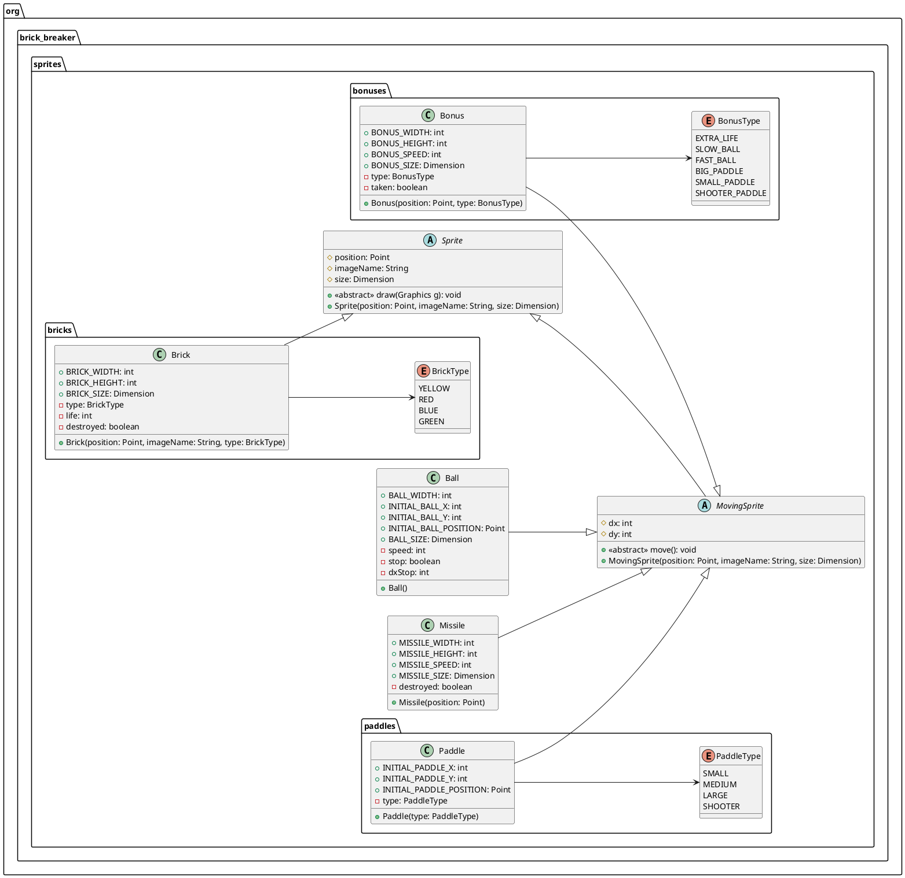

# Actividad 3: Actualizando Sprites

## Descripción

En esta actividad vamos a cambiar algunas características de nuestras clases de sprites y agregaremos un nuevo tipo. Lo
anterior derivado del uso de clases abstractas y herencia.

## Diagrama de clases

## Instrucciones

Como podrás notar, en el diagrama de clases se han agregado nuevas clases y enumeraciones. Tu tarea será implementar
adecuar las clases `Ball`, `Missile`, `Bonus`, `Brick` y `Paddle` para que cumplan con las siguientes características:

1. `Ball`:
    - La pelota debe tener un tamaño de 20x20 pixeles.
    - La pelota debe tener una velocidad inicial de 2 píxeles por movimiento.
    - La pelota debe sobreescribir los métodos `draw` y `move` de la clase `MovingSprite`.
    - La coordenada inicial de la pelota es (**x: 224, y: 585**) pixeles.
2. `Missile`:
    - El misil debe tener un tamaño de 16x37 pixeles.
    - El misil debe tener una velocidad de 5 píxeles por movimiento.
    - El misil debe sobreescribir los métodos `draw` y `move` de la clase `MovingSprite`.
3. `Bonus`:
    - El bono debe tener un tamaño de 42x21 pixeles.
    - El bono debe tener una velocidad de 2 píxeles por movimiento.
    - El bono debe sobreescribir los métodos `draw` y `move` de la clase `MovingSprite`.
4. `BonusType`:
    - Debe tener los siguientes tipos de bonos: `EXTRA_LIFE`, `SLOW_BALL`, `FAST_BALL`, `BIG_PADDLE`, `SMALL_PADDLE` y
      `SHOOTER_PADDLE`.
5. `Brick`:
    - El ladrillo debe tener un tamaño de 42x20 pixeles.
    - El ladrillo debe sobreescribir el método `draw` de la clase `Sprite`.
6. `Paddle`:
    - El tamaño de la raqueta está dado por su tipo.
    - Las coordenadas iniciales de la raqueta son (**x: 202, y: 604**) pixeles.
    - La paleta debe sobreescribir los métodos `draw` y `move` de la clase `MovingSprite`.
7. `PaddleType`:
    - Debe tener los siguientes tipos de raquetas: `SMALL`, `MEDIUM`, `LARGE` y `SHOOTER`.
    - `SMALL` tiene un tamaño de 32x16 pixeles.
    - `MEDIUM` tiene un tamaño de 64x16 pixeles.
    - `LARGE` tiene un tamaño de 96x16 pixeles.
    - `SHOOTER` tiene un tamaño de 64x16 pixeles.

> Recuerda que las constantes de las clases deben ser `public static final` y que los atributos de las clases deben ser
`private`. Y que las constantes locales de una clase deben ser `private static final`.

## Entregables

- Esta actividad no tiene entregables, pero es importante que la realices para que puedas avanzar con las siguientes
  actividades.