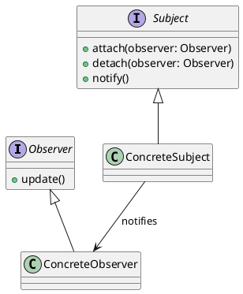

# El Patron de Diseño Observer

El Patrón de Diseño Observer es un patrón de diseño de software que define una relación uno a muchos entre objetos, de
tal manera que cuando un objeto cambia su estado, todos sus dependientes son notificados y actualizados automáticamente.
Este patrón es muy útil en situaciones donde un cambio en un objeto requiere cambios en otros objetos, y no se conoce de
antemano cuántos objetos necesitan ser notificados.

## Estructura del Patrón Observer

El patrón Observer se compone de dos tipos principales de objetos:



### Interfaces

- **Observer**: Esta interfaz define el método `update()`, que es llamado por el sujeto cuando su estado cambia. Los
  observadores concretos implementan esta interfaz para recibir notificaciones de cambios.
- **Subject**: Esta interfaz define los métodos `attach()`, `detach()` y `notify()`. Los sujetos concretos implementan
  esta interfaz para gestionar la lista de observadores y notificarles sobre los cambios en su estado.
- **ConcreteSubject**: Esta clase concreta implementa la interfaz `Subject` y mantiene una lista de observadores. Cuando
  su
  estado cambia, llama al método `notify()` para informar a todos los observadores.
- **ConcreteObserver**: Esta clase concreta implementa la interfaz `Observer` y define cómo reaccionar ante las
  notificaciones del sujeto. Cuando el sujeto cambia su estado, el observador actualiza su propio estado en
  consecuencia.

## Ejemplo de Implementación

A continuación se presenta un ejemplo simple de cómo implementar el patrón Observer en Java:

```java
import java.util.ArrayList;
import java.util.List;

// Interfaz Observer
interface Observer {
    void update(String message);
}

// Interfaz Subject
interface Subject {
    void attach(Observer observer);

    void detach(Observer observer);

    void notifyObservers(String message);
}

// Clase concreta Subject
class ConcreteSubject implements Subject {
    private List<Observer> observers = new ArrayList<>();

    @Override
    public void attach(Observer observer) {
        observers.add(observer);
    }

    @Override
    public void detach(Observer observer) {
        observers.remove(observer);
    }

    @Override
    public void notifyObservers(String message) {
        for (Observer observer : observers) {
            observer.update(message);
        }
    }

    public void changeState(String message) {
        System.out.println("ConcreteSubject: " + message);
        notifyObservers(message);
    }
}

// Clase concreta Observer
class ConcreteObserver implements Observer {
    private String name;

    public ConcreteObserver(String name) {
        this.name = name;
    }

    @Override
    public void update(String message) {
        System.out.println(name + " received update: " + message);
    }
}

// Clase principal
public class ObserverPatternExample {
    public static void main(String[] args) {
        ConcreteSubject subject = new ConcreteSubject();

        ConcreteObserver observer1 = new ConcreteObserver("Observer 1");
        ConcreteObserver observer2 = new ConcreteObserver("Observer 2");

        subject.attach(observer1);
        subject.attach(observer2);

        subject.changeState("State changed to 1");
        subject.changeState("State changed to 2");
    }
}
```

## Ventajas del Patrón Observer

- **Desacoplamiento**: Los sujetos y observadores están desacoplados, lo que permite una mayor flexibilidad y
  reutilización del
  código.
- **Facilidad de mantenimiento**: Los cambios en un sujeto no requieren cambios en los observadores, lo que facilita el
  mantenimiento del código.
- **Escalabilidad**: Se pueden agregar o eliminar observadores en tiempo de ejecución sin afectar al sujeto.
- **Soporte para múltiples observadores**: Un sujeto puede tener múltiples observadores, lo que permite una comunicación
  eficiente entre ellos.
- **Soporte para eventos**: El patrón Observer es ideal para implementar sistemas basados en eventos, donde los cambios
  en el estado de un objeto deben ser notificados a otros objetos.
- **Facilidad de implementación**: El patrón Observer es fácil de implementar y entender, lo que lo convierte en una
  opción popular para muchos desarrolladores.

## Desventajas del Patrón Observer

- **Complejidad**: En sistemas grandes, la gestión de múltiples observadores puede volverse compleja y difícil de
  mantener.
- **Rendimiento**: Si hay muchos observadores, el rendimiento puede verse afectado debido a la sobrecarga de
  notificaciones.
- **Dependencias cíclicas**: Si no se gestiona adecuadamente, puede haber dependencias cíclicas entre sujetos y
  observadores, lo que puede llevar a problemas de memoria y rendimiento.
- **Dificultad para depurar**: La naturaleza asíncrona del patrón Observer puede dificultar la depuración de problemas
  relacionados con la comunicación entre sujetos y observadores.

## Conclusión

El patrón de diseño Observer es una herramienta poderosa para gestionar la comunicación entre objetos en sistemas
complejos. Su estructura flexible y desacoplada permite una fácil implementación y mantenimiento, lo que lo convierte en
una opción popular en el desarrollo de software. Sin embargo, es importante tener en cuenta sus desventajas y
considerar su uso en el contexto adecuado. Al comprender cómo funciona el patrón Observer y sus ventajas y
desventajas, los desarrolladores pueden tomar decisiones informadas sobre su uso en sus aplicaciones.