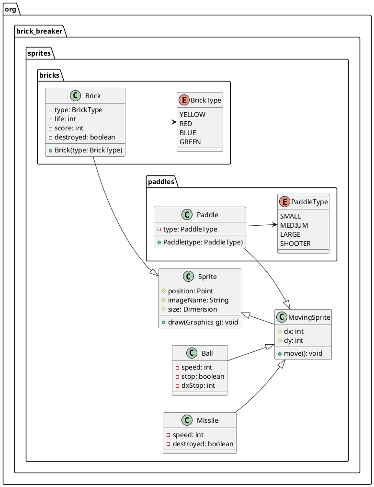

# Actividad 1: Los Sprites

## Descripción

En esta actividad, crearemos la clase `Sprite` que representa un objeto gráfico en la pantalla. Un `Sprite` tiene una
posición, una imagen y un tamaño. La clase `Sprite` también tiene métodos para mover el sprite y para dibujarlo en la
pantalla.

Así mismo definiremos una estructura de herencia para los sprites que se mueven y los que no se mueven. De igual manera
definiremos una estructura de herencia para clases de sprites como el `Brick`, `Paddle` y `Ball`.

## Objetivos

* Crear la clase `Sprite`.
* Crear la clase `StaticSprite` que hereda de `Sprite`.
* Crear la clase `MovingSprite` que hereda de `Sprite`.
* Crear las clases  `Brick`, `Paddle` y `Ball` que heredan de `StaticSprite` y `MovingSprite`.
* Crear el tipo enumerado `BrickType` que define los tipos de ladrillos.
* Crear el tipo enumerado `BallType` que define los tipos de pelotas.
* Crear el tipo enumerado `PaddleType` que define los tipos de paletas.

## Diagrama de clases

El siguiente diagrama de clases muestra la estructura de clases de los sprites:



## Implementación

### Clase `Sprite`

La clase `Sprite` representa un objeto gráfico en la pantalla. Un `Sprite` tiene una posición, una imagen y un tamaño.

```java
import java.awt.Point;
import java.awt.Dimension;
import java.awt.Graphics;

public class Sprite {
    protected Point position;
    protected String imageName;
    protected Dimension size;

    public Sprite(Point position, String imageName, Dimension size) {
        this.position = position;
        this.imageName = imageName;
        this.size = size;
    }

    public void draw(Graphics g) {
        // Dibujar el sprite en la pantalla
    }
}
```

> **Los ejemplos de clases del proyecto no incluyen los paquetes por simplicidad. Sin embargo, en tu proyecto debes
> incluir los paquetes adecuados. Así mismo, los métodos y atributos de las clases deben ser completados con la lógica
> necesaria. Y por último no se colocarán métodos `get` y `set` por simplicidad.**
> {style="note"}

### Clase `MovingSprite`

La clase `MovingSprite` hereda de `Sprite` y representa un sprite que se mueve en la pantalla. Un `MovingSprite` tiene
una velocidad en las direcciones `x` e `y`.

```java
public class MovingSprite extends Sprite {
    protected int dx;
    protected int dy;

    public MovingSprite(Point position, String imageName, Dimension size, int dx, int dy) {
        super(position, imageName, size);
        this.dx = dx;
        this.dy = dy;
    }

    public void move() {
        // Mover el sprite en la pantalla
    }
}
```

En este caso debemos de tener en cuenta que si los atributos `dx` y `dy` son positivos el sprite se moverá hacia la
derecha y hacia abajo respectivamente. Si son negativos se moverá hacia la izquierda y hacia arriba respectivamente.

Por consiguiente, deberás implementar la función `move` para que el sprite se mueva en la pantalla.

### Clase `Ball`

La clase `Ball` hereda de `MovingSprite` y representa una pelota en el juego. La clase `Ball` tiene un atributo `speed`
que representa la velocidad de la pelota.

```java
public class Ball extends MovingSprite {
    private int speed;
    private boolean stop;
    private int dxStop;

    public Ball(Point position, String imageName, Dimension size, int speed) {
        super(position, imageName, size, ??, ??);
        this.speed = speed;
        this.stop = false;
        this.dxStop = 0;
    }
}
```

En este caso debes de completar los atributos `dx` y `dy` de la clase `Ball` para que la pelota se mueva en la pantalla.
Toma en cuenta que la velocidad de la pelota es constante y se define en el constructor. Y que si se mueve a una
velocidad de 3, esto quiere decir que se movera 3 pixeles en cada dirección. Por lo tanto, si la pelota se mueve hacia
la derecha, `dx` será igual a 3 y si se mueve hacia arriba, `dy` será igual a -3.

Pos consiguiente la tabla de movimientos de la pelota es la siguiente:

| Dirección        | `dx` | `dy` |
|------------------|------|------|
| Arriba           | 0    | -3   |
| Abajo            | 0    | 3    |
| Izquierda        | -3   | 0    |
| Derecha          | 3    | 0    |
| Arriba-Izquierda | -3   | -3   |
| Arriba-Derecha   | 3    | -3   |
| Abajo-Izquierda  | -3   | 3    |
| Abajo-Derecha    | 3    | 3    |

Además, la pelota tiene un atributo `stop` que indica si la pelota está detenida y un atributo `dxStop` que indica la
dirección en la que se moverá sobre el eje `x` cuando se detenga. Por ejemplo, si `dxStop` es igual a -1, la pelota se
moverá hacia la izquierda cuando se invoque el método `move`. Mientras que si `dxStop` es igual a 1, la pelota se moverá
hacia la derecha. Y si `dxStop` es igual a 0, la pelota no se moverá.

### Clase `Missile`

La clase `Missile` hereda de `MovingSprite` y representa un misil en el juego. La clase `Missile` tiene un atributo
`speed` que representa la velocidad del misil y un atributo `destroyed` que indica si el misil ha sido destruido.

```java
public class Missile extends MovingSprite {
    private int speed;
    private boolean destroyed;

    public Missile(Point position, String imageName, Dimension size, int speed) {
        super(position, imageName, size, ??, ??);
        this.speed = speed;
        this.destroyed = false;
    }
}
```

En este caso debes de completar los atributos `dx` y `dy` de la clase `Missile` para que el misil se mueva en la
pantalla. Toma en cuenta que la velocidad del misil es constante y se define en el constructor. Y que si se mueve a una
velocidad de 5, esto quiere decir que se moverá 5 píxeles hacia arriba desde donde fue lanzado.

Por consiguiente, deberás implementar la función `move` para que el misil se mueva en la pantalla.

### Clase `BrickType`

El tipo enumerado `BrickType` define los tipos de ladrillos que se pueden utilizar en el juego. Los tipos de ladrillos
son `YELLOW`, `RED`, `BLUE` y `GREEN`. Cada ladrillo tiene un color, una cantidad de vidas y un puntaje asociado.

```java
public enum BrickType {
    YELLOW(1, 10),
    RED(2, 20),
    BLUE(3, 30),
    GREEN(4, 40);
    
    private final int life;
    private final int score;
    
    BrickType(int life, int score) {
        this.life = life;
        this.score = score;
    }
}
```

Para la entrega deberás modificar el enumerado `BrickType` para que cada tipo de ladrillo tenga una cantidad de vidas y
un puntaje asociado, distintos a los propuestos en el ejemplo.

### Clase `Brick`

La clase `Brick` hereda de `StaticSprite` y representa un ladrillo en el juego. La clase `Brick` tiene un atributo
`type` que indica el tipo de ladrillo, un atributo `life` que indica la cantidad de vidas del ladrillo, un atributo
`score` que indica el puntaje asociado al ladrillo y un atributo `destroyed` que indica si el ladrillo ha sido
destruido.

```java
public class Brick extends StaticSprite {
    private BrickType type;
    private int life;
    private int score;
    private boolean destroyed;

    public Brick(Point position, String imageName, Dimension size, BrickType type) {
        super(position, imageName, size);
        this.type = type;
        this.life = type.getLife();
        this.score = type.getScore();
        this.destroyed = false;
    }
    
    public void hit() {
        // Disminuir la vida del ladrillo
    }
}
```

En este caso debes de completar el método `hit` de la clase `Brick` para que disminuya la vida del ladrillo cuando sea
golpeado. Si la vida del ladrillo llega a 0, el ladrillo debe ser destruido.

### Clase `PaddleType`

El tipo enumerado `PaddleType` define los tipos de paletas que se pueden utilizar en el juego. Los tipos de paletas son
`SMALL`, `MEDIUM`, `LARGE` y `SHOOTER`.

```java
public enum PaddleType {
    SMALL,
    MEDIUM,
    LARGE,
    SHOOTER
}
```

### Clase `Paddle`

La clase `Paddle` hereda de `StaticSprite` y representa una paleta en el juego. La clase `Paddle` tiene un atributo
`type` que indica el tipo de paleta.

```java
public class Paddle extends StaticSprite {
    private PaddleType type;

    public Paddle(Point position, String imageName, Dimension size, PaddleType type) {
        super(position, imageName, size);
        this.type = type;
    }
    
    public void shoot() {
        // Disparar un misil
    }
}
```

En este caso debes de completar el método `shoot` de la clase `Paddle` para que dispare un misil en el juego. Toma en
cuenta que solo deberá disparar un misil si la paleta es de tipo `SHOOTER`.

## Conclusión

En esta actividad, hemos creado la clase `Sprite` que representa un objeto gráfico en la pantalla. También hemos creado
las clases `StaticSprite` y `MovingSprite` que heredan de `Sprite` y representan sprites estáticos y móviles,
respectivamente. Además, hemos creado las clases `Brick`, `Paddle` y `Ball` que heredan de `StaticSprite` y
`MovingSprite` y representan ladrillos, paletas y pelotas en el juego. También hemos definido los tipos enumerados
`BrickType`, `PaddleType` y `BallType` que definen los tipos de ladrillos, paletas y pelotas que se pueden utilizar en
el juego.

En la próxima actividad trabajaremos con otros Sprites como los bordes del juego y el fondo del juego.

## Actividad

1. Implementa las clases `Sprite`, `MovingSprite`, `Ball`, `Missile`, `BrickType`, `Brick`, `PaddleType` y `Paddle`
   siguiendo las especificaciones dadas.
2. Modifica el enumerado `BrickType` para que cada tipo de ladrillo tenga una cantidad de vidas y un puntaje asociado,
   distintos a los propuestos en el ejemplo.
3. Completa el método `hit` de la clase `Brick` para que disminuya la vida del ladrillo cuando sea golpeado. Si la vida
   del ladrillo llega a 0, el ladrillo debe ser destruido.
4. Completa el método `shoot` de la clase `Paddle` para que dispare un misil en el juego. Toma en cuenta que solo deberá
   dispar un misil si la paleta es de tipo `SHOOTER.
5. Realiza pruebas unitarias para verificar el correcto funcionamiento de las clases implementadas.
6. Realiza pruebas de integración para verificar la interacción entre las clases implementadas.
7. Toma capturas de pantalla de las pruebas realizadas y agrégalas a la documentación de la actividad.
8. Comprime el proyecto en un archivo ZIP y envíalo a través de la plataforma.

## Entrega

La entrega de la actividad se realizará a través de la plataforma y deberá contener los siguientes elementos:

1. Archivo ZIP con el proyecto de Java que contenga las clases implementadas.
2. Portada con datos de identificación de los miembros del equipo.
3. Documentación de clases y tipos enumerados.

## Criterios de evaluación

| Criterio               | Descripción                                                                                                       | Puntaje |
|------------------------|-------------------------------------------------------------------------------------------------------------------|---------|
| Portada                | Contiene los datos de identificación de los integrantes del equipo (nombres completos, grupo, número de control). | 5%      |
| Documentación          | Contiene la documentación de las clases y tipos enumerados implementados.                                         | 5%      |
| Implementación         | Las clases y tipos enumerados implementados cumplen con las especificaciones dadas.                               | 60%     |
| Pruebas unitarias      | Se han realizado pruebas unitarias para verificar el correcto funcionamiento de las clases implementadas.         | 10%     |
| Pruebas de integración | Se han realizado pruebas de integración para verificar la interacción entre las clases implementadas.             | 10%     |
| Entrega                | El archivo ZIP contiene todos los elementos solicitados.                                                          | 10%     |
| Total                  |                                                                                                                   | 100%    |

## Fecha de entrega

La fecha límite de entrega es el **lunes 10 de marzo de 2025** a las **23:59 hrs**.

> **Trabajos entregados después de la fecha y hora límite serán calificados sobre 70 puntos como máximo.**
> {style="warning"}

> **Integrante que no aparezca en la portada del documento no será calificado.**
> {style="warning"}